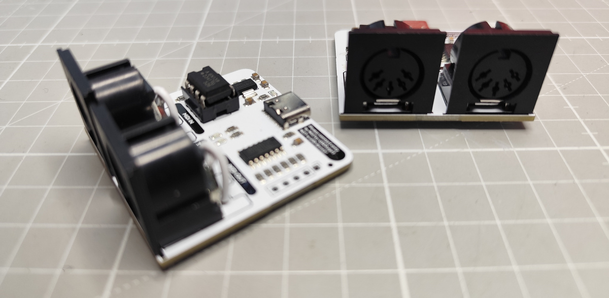
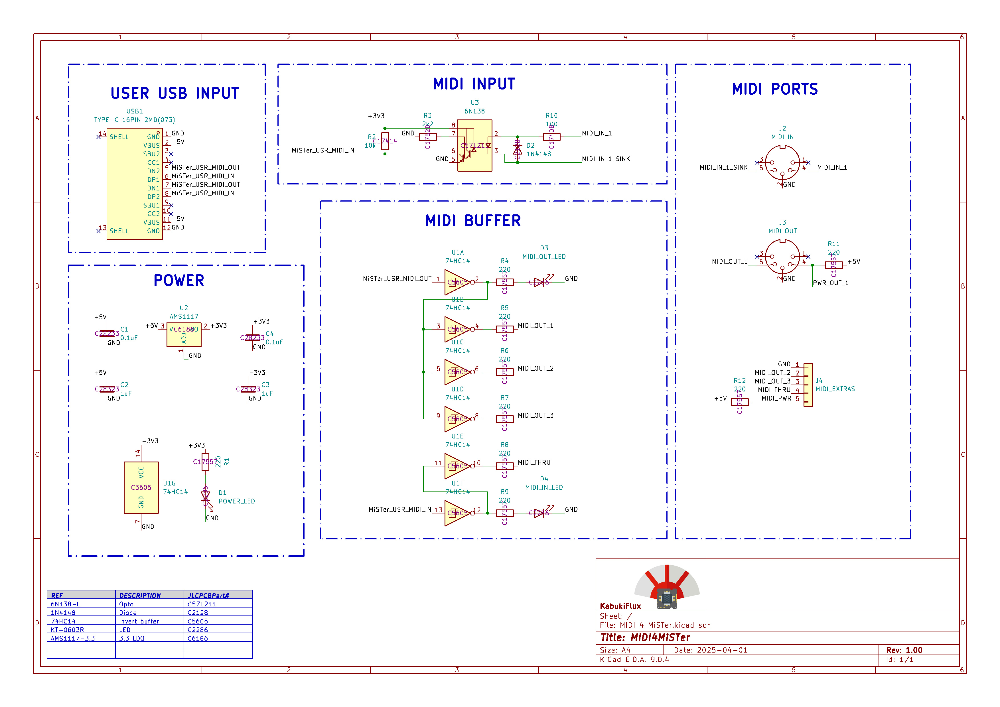
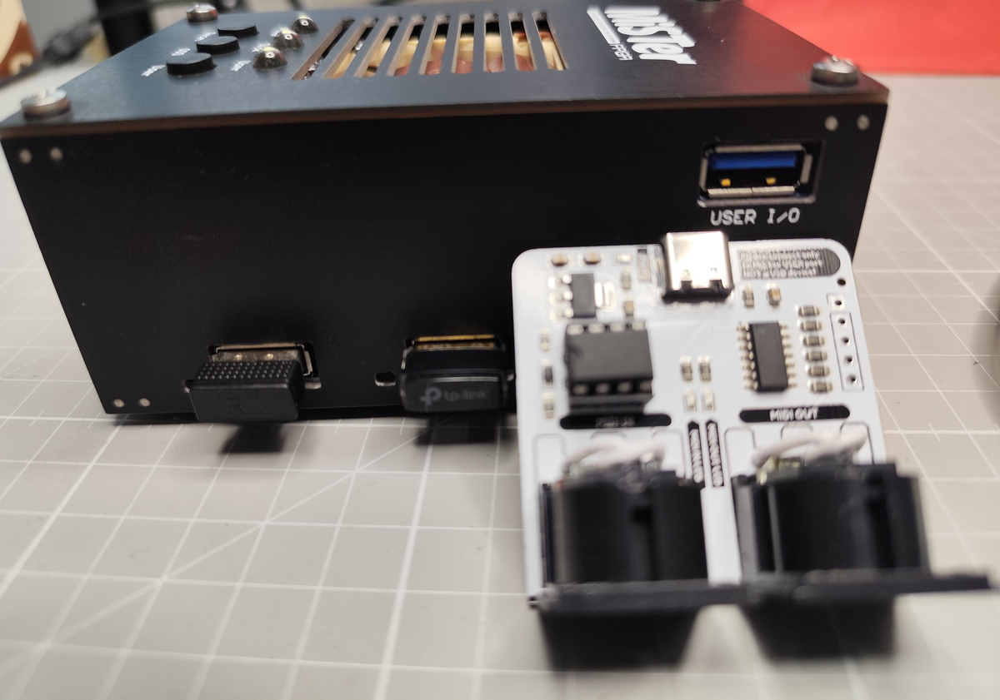
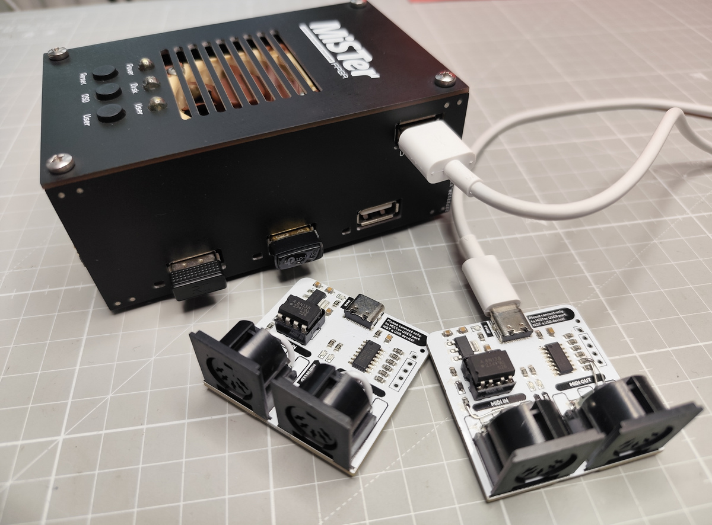

# MIDI4MiSTer / MiSTer FPGA User IO – MIDI Interface Board

This repository contains the **KiCAD project files** for a custom **MIDI Interface
Board**, designed to connect to the **User IO port** of the **MiSTer FPGA**.  
It enables **MIDI input and output** functionality for cores that support MIDI,
including the **Atari ST**, **X68000**, **PC**, and **Minimig**.  

### ☢️ WARNING: Do not connect to the regular USB ports on the MiSTer ☢️

## Table of contents

- [Why](#why)
- [Description](#-description)
- [Schematics](#-schematics)
- [Installation Guide](#-installation-guide)
- [Repository contents](#-repository-contents)
- [Disclaimer](#-disclaimer)

## Why?

The goal of this project is to provide a simple and reliable way to connect
external MIDI hardware (keyboards, synthesizers, modules) to the MiSTer FPGA platform.  

If you enjoy exploring the full capabilities of MiSTer cores such as the **Atari ST**,
**Minimig**, **ao486 (PC)** or **X68000** with authentic MIDI input/output, this board
makes it possible.  

## 📜 Description

MiSTer already supports MIDI in several cores, but connecting external gear requires
proper electrical isolation and signal compliance with the MIDI standard.  
This board provides exactly that:  

- **MIDI IN** with optocoupler isolation (protects MiSTer from faulty external devices)  
- **MIDI THRU** with proper current-loop driver (for the MIDI in port)
- **MIDI OUT** with proper current-loop driver, 3x MIDI Out
- **Compatible with MiSTer cores that support MIDI** (Atari ST, X68000, PC, Minimig, and more in the future)  
- **Includes KiCAD project files** for modification and PCB manufacturing  

This design does not emulate MIDI or add new core support—it acts as a hardware 
bridge for existing MiSTer MIDI features.

## 📝 Schematics

This is the schematics:

## 🛠️ Installation Guide

### 1️⃣ Preparation  

1. Send the **Gerber files** (`/gerbers/`) to a PCB manufacturer such as
[JLCPCB](https://jlcpcb.com/) or your preferred supplier.  
2. Collect the required components (see the Bill of Materials [BOM](bom/ibom.html)).  
3. Solder the components onto the PCB.  

### 2️⃣ Installation Steps  

1. Power off your **MiSTer FPGA**.  
2. Connect the MIDI Interface Board to the **_User IO port_** using the provided header.  
3. Attach your MIDI hardware:  
   - Connect a MIDI keyboard, module, or sequencer to the **MIDI IN** port.  
   - Connect the **MIDI OUT** port to an external synth or interface SC-55, MT32...  
4. Power on the MiSTer and load a supported core (e.g., Atari ST).  
5. Configure the core’s settings to use **MIDI** and test with your device
6. Usually you don't need to configure anything on the MiSTer menu side, only inside the core. 

#### How to use it - Video

## 📝 Repository Contents  

- **`/kicad/`** – KiCAD design files for the MIDI Interface Board  
- **`/bom/`** – Circuit parts and assembly guide  
- **`/gerbers/`** – Gerber files for PCB fabrication  
- **`/assets/`** – Images of schematics, renders, and assembled board  

## 📢 Disclaimer  

I'm not responsible  
===================  
No liability is assumed for misuse or damage.

DISCLAIMER (See Licensing)  
==========================  
See [LICENSE](LICENSE) for more information.  

This project is intended for hobbyist and educational purposes. 
**Use at your own risk.** The MiSTer FPGA and connected MIDI hardware must
be in **good working condition** before use. This repository is **not affiliated with MiSTer project developers** but we support them.  
The 3D models and footprints belong to each license holder.